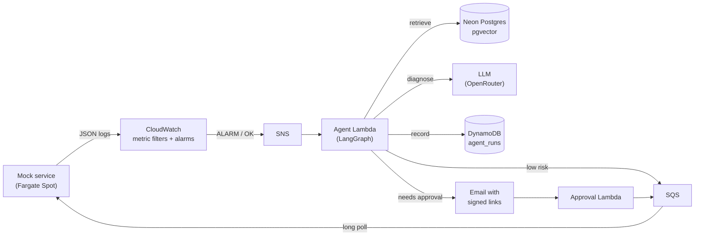

# Self-Healing Ops Agent

An AIOps agent that watches a service, diagnoses incidents with RAG over
runbooks, and fixes them: automatically when the risk is low, after a
human approves a signed link when it isn't. It then confirms the fix
worked by watching the alarm clear.

The "production system" is a Spring Boot mock service with ten injectable
failure modes (connection pool exhaustion, deadlocks, memory leak → OOM,
disk full, retry storms, ...) that emit realistic structured logs and
metrics. Everything else is built as it would be for a real service:
alarms, an event-driven agent, a remediation queue, least-privilege IAM,
Terraform, and OIDC-based CI/CD.



## How an incident flows

1. A failure starts; the service logs `event_type=simulated_failure` lines.
2. A CloudWatch metric filter counts them; the alarm fires into SNS.
3. The agent Lambda claims the run (idempotent against duplicate delivery),
   pulls the alarm's log lines, and runs the LangGraph pipeline:
   validate → retrieve runbook sections → web search if retrieval is weak →
   diagnose and plan with the LLM → risk gate.
4. Low/medium risk with auto-remediation on: the fix goes on an SQS queue.
   Otherwise an email with approve/reject links goes out; the links are
   HMAC-signed, expire, work once, and opening one changes nothing until
   you confirm.
5. The service pulls the action from the queue, re-checks it against its own
   allowlist, and applies it.
6. When the alarm returns to OK, the run is stamped with `seconds_to_recover`.
   Recovery is judged by the metric, not by the executor saying it ran.

## Evaluation

Measured with [`eval_agent.py`](eval_agent.py) against the real pipeline
(live embeddings and LLM, pgvector), on the ten captured failure logs in
[`captured-logs/`](captured-logs/). Raw results are in
[`eval_results/`](eval_results/).

**Blind classification: can it tell *what* broke with no label?** Each log
is searched against the whole runbook corpus, no failure-type filter.

| Input the search sees | recall@1 | recall@3 | MRR |
|---|---|---|---|
| **Symptoms only** (injection lines and every `failure_mode` tag stripped) | **80%** | **100%** | **0.90** |
| As the agent receives it (tags kept) | 80% | 100% | 0.90 |
| Raw fixture (before the injection-line fix) | 70% | 100% | 0.85 |

The two misses rank second behind their nearest neighbour: OOM kill behind
memory leak, thread-pool exhaustion behind connection-pool exhaustion.

**Retrieval confidence calibration.** Symptoms-only top similarities span
0.715–0.774 and tagged inputs 0.743–0.813. The agent's web-search threshold
(`RETRIEVAL_CONFIDENCE_THRESHOLD = 0.72`) sits inside the first range, so
on label-free input it would trigger web search for about a third of
incidents even when retrieval ranked the right runbook first. It needs
re-deriving from these numbers.

**End to end: is the diagnosis right and the risk call safe?** *Pending.*
`python eval_agent.py e2e` scores, per failure mode: root cause on topic
(keyword rubric from the runbook's "Likely root causes"), LLM risk vs
runbook risk (flagging under-rating, the unsafe direction), whether it
escalated exactly when the runbook says high risk, and latency. The first
run hit OpenRouter's free tier limit (50 requests/day, embeddings
included) before any diagnosis completed. It still found a bug: a rate
limit during the summarize-and-retry step raised out of the graph instead
of ending in `diagnosis_failed` (fixed, with a regression test).

**What these numbers don't show:** ten fixtures, one run each; free-tier
models vary between runs; the on-topic check is a keyword rubric (catches
answers about the wrong failure, not subtle reasoning errors). In
production the alarm's metric name already tells the agent the failure
type, so the end-to-end score is about root cause and risk, not
classification.

### Honesty fixes the evaluation drove
- **The agent could read the answer off its input.** The admin API logs
  "failure mode X activated", and that line reached the agent. It's now
  filtered out everywhere the agent gets logs. (For retrieval this turned
  out harmless: one line among ~30 barely moves an embedding.)
- **The mock tags every log line with the answer** (`failure_mode` field),
  which real services don't. The blind test strips it; tags raise
  similarity by 0.02–0.06 but never changed a ranking.
- **Tests only passed because a real `.env` was reachable** from a parent
  folder. They now set a dummy key and pass on a clean CI runner.

## Quick start (local)

Requirements: Docker, Java 17 + Maven 3.9, Python 3.12+.

```bash
cp .env.example .env                 # add OPENROUTER_API
docker compose up -d --build         # mock service :8080 + pgvector :5432
docker compose run --rm agent python index_runbooks.py --reset
```

Break something and diagnose it:

```bash
curl -X POST localhost:8080/admin/failures/disk_full/activate
curl localhost:8080/api/orders/1     # ~50% fail with a write error
docker compose run --rm agent python run_real_alert.py \
    --failure-type DISK_FULL --log-file captured-logs/disk_full.log
curl -X POST localhost:8080/admin/failures/reset
```

Evaluate:

```bash
docker compose run --rm agent python eval_agent.py blind   # symptoms only
docker compose run --rm agent python eval_agent.py e2e
```

## The failure modes

| Mode | Signal the alarm counts | Runbook risk |
|---|---|---|
| `CONNECTION_POOL_EXHAUSTION` | `simulated_failure` (503s) | low |
| `DB_DEADLOCK` | `simulated_failure` (lock timeouts) | medium |
| `SLOW_DOWNSTREAM_DEPENDENCY` | `high_latency` (2–5 s requests) | low |
| `MEMORY_LEAK` | `memory_growth` (+40 MB / 5 s) | medium |
| `OOM_KILL` | `process_killed` | high |
| `DISK_FULL` | `simulated_failure` (write errors) | high |
| `THREAD_POOL_EXHAUSTION` | `simulated_failure` (>20 in flight) | low |
| `BAD_DEPLOY_ERROR_SPIKE` | `simulated_failure` (NPEs) | high |
| `CONFIG_DRIFT` | `simulated_failure` (missing env var) | medium |
| `RETRY_STORM` | `simulated_failure` (>50 req / 10 s) | medium |

Inject with `POST /admin/failures/{mode}/activate`; list with
`GET /admin/failures`; clear with `POST /admin/failures/reset`. Metrics at
`/actuator/prometheus`. Runbooks: [`RAGcourps/`](RAGcourps/).

## Design decisions worth asking about

- **The LLM never chooses what executes.** Its plan is advisory text; the
  executable action comes from a fixed table keyed on failure type, is
  validated before queueing, and validated again by the service against its
  own allowlist. A prompt-injected log line can change what the plan says,
  not what runs.
- **Shadow mode by default.** `AUTO_REMEDIATE=false` sends every fix,
  even low risk, to a human until the diagnoses have earned trust.
- **Idempotency under at-least-once delivery.** Runs are claimed with a
  conditional write plus a lease and an ownership token: duplicates are
  no-ops, crashed runs can be taken over, a stale attempt can't overwrite
  its replacement.
- **Approval links are bearer credentials,** so: HMAC-signed, expiring,
  single use (conditional write), GET only renders a confirmation page
  (mail scanners prefetch links), all LLM text HTML-escaped on the page.
- **Pull, not push, for remediation.** The service polls SQS, so it needs
  no stable address, no load balancer (~$16/month saved), and its admin
  API is never reachable by the agent.
- **Secrets never enter Terraform state** (ephemeral values via write-only
  attributes), which is also why the pull-request CI role can read state
  safely.
- **One tools layer, two front doors.** The LangGraph agent and the
  [MCP server](mcp_server.py) call the same functions; no MCP tool can
  approve or execute a fix.

Full rationale, alternatives rejected and costs:
[`docs/aws-deployment.md`](docs/aws-deployment.md).

## Deployment (AWS, ~$7–9/month)

Fargate Spot, CloudWatch alarms, three container Lambdas (agent, approval,
MCP), SQS, DynamoDB, SSM, Neon's free Postgres, and a $20 budget alarm, all
in Terraform ([`infra/`](infra/)). GitHub Actions deploys on push to `main`
using OIDC (no stored AWS keys), with every action pinned to a commit SHA.
Setup steps: [`docs/aws-deployment.md`](docs/aws-deployment.md#deploying-first-time).

## MCP server

Exposes runbook search, logs, diagnosis and run history to any MCP client
over stdio (`python mcp_server.py`), HTTP with a bearer token
(`docker compose --profile mcp up -d mcp`), or a Lambda Function URL. Write
tools are opt-in (`MCP_ENABLE_WRITE_TOOLS=true`).

## Project layout

| Path | What |
|---|---|
| `src/` | Mock service (Spring Boot): failure injection, SQS remediation executor |
| `agentic.py`, `llm.py`, `searchllm.py` | LangGraph agent, LLM client, web search |
| `lambda_handler.py`, `approval_handler.py`, `mcp_server.py` | The three Lambda entrypoints |
| `tools/` | Shared layer: config, logs, runs store, remediation, approval, runbooks |
| `chunk_runbooks.py`, `index_runbooks.py`, `query_retrieval.py`, `init.sql` | RAG pipeline |
| `RAGcourps/` | Runbooks, one per failure mode |
| `captured-logs/`, `capture-logs.ps1` | Real log fixtures and the script that captures them |
| `eval_agent.py`, `eval_results/` | Evaluation harness and results |
| `infra/` | Terraform (+ `bootstrap/` for state bucket and CI roles) |
| `.github/` | CI and deploy workflows, Dependabot |
| `test_*.py`, `unittes.py`, `src/test/` | 100 Python + 8 Java tests; no network or AWS account needed |

## Tests

```bash
mvn verify
pip install -r requirements-dev.txt
python -m unittest test_eval_agent test_mcp_server test_remediation test_lambda_handler unittes
```

AWS is emulated in-memory (moto) and every LLM/embedding call is stubbed, so
the suite runs offline and on forks.

## Known limitations

- Remediation is limited to what the mock can do (clearing a failure mode);
  a real deployment would add restart, scale-out and rollback actions to the
  allowlist.
- The risk gate trusts the LLM's risk rating; flooring it at the runbook's
  risk level is the next safety change (see the evaluation above).
- Not yet deployed: Terraform is validated and scanned, the workflows are
  linted and reproduced locally, but neither has run against a real account.
